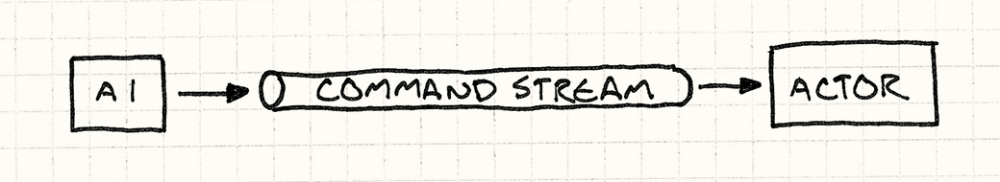
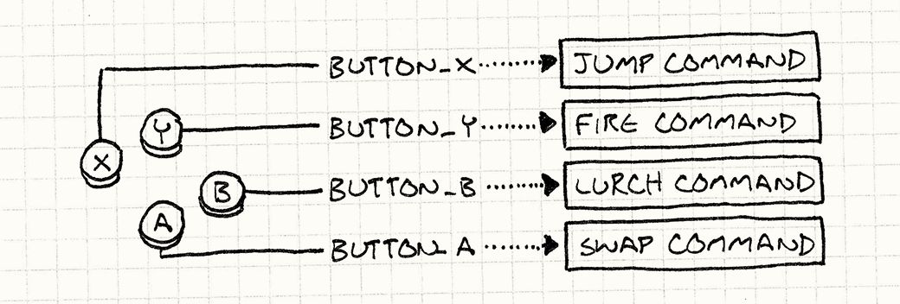
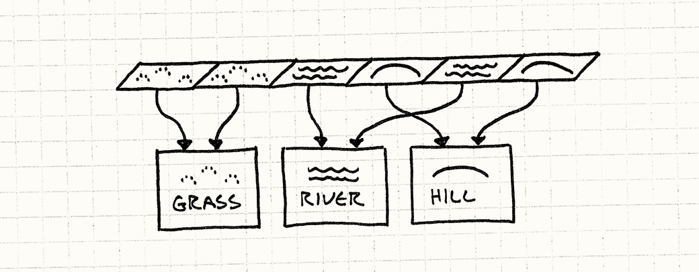
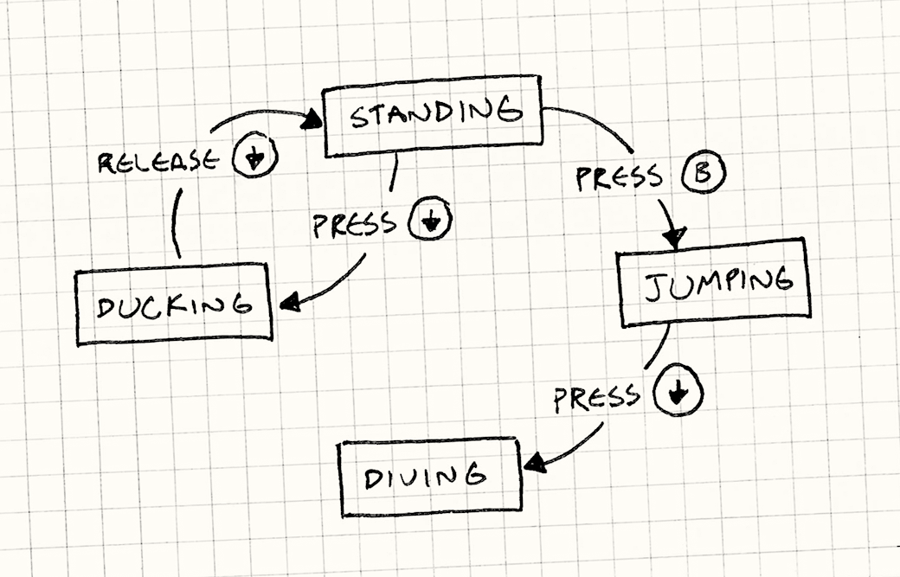

# Design Patterns

<!-- TOC depthFrom:1 depthTo:6 withLinks:1 updateOnSave:1 orderedList:0 -->

- [Design Patterns](#design-patterns)
	- [Programming Patterns](#programming-patterns)
		- [Command](#command)
			- [Configuring Input](#configuring-input)
			- [Undo and Redo](#undo-and-redo)
			- [Conclusion](#conclusion)
		- [Flyweight](#flyweight)
		- [Singleton](#singleton)
		- [Factory](#factory)
		- [Strategy](#strategy)
		- [Spatial Index](#spatial-index)
		- [Composite](#composite)
		- [Flyweight](#flyweight)
	- [Usability Patterns](#usability-patterns)
		- [Shield](#shield)
		- [State](#state)
		- [Automatic Mode Cancellation](#automatic-mode-cancellation)
		- [Magnetism](#magnetism)
		- [Focus](#focus)
		- [Progress](#progress)

<!-- /TOC -->

## Programming Patterns

### Command
- A command is a reified (= make real) method call. It’s a method call wrapped in an object.
- Commands are an object-oriented replacement for callbacks.
- Define a base class that represents a triggerable game command
- The input handler or AI produces commands and places them in the stream
- The dispatcher or actor itself consumes commands and invokes them.

- We decouple the producer on one end from the consumer on the other.

#### Configuring Input
```cpp
class Command
{
public:
  virtual ~Command() {}
  virtual void execute(GameActor& actor) = 0;
  virtual void undo() = 0;
};

class JumpCommand : public Command
{
public:
	virtual void execute(GameActor& actor)
    {
      actor.jump();
    }
};

class FireCommand : public Command
{
public:
	virtual void execute(GameActor& actor)
    {
      actor.fireGun();
    }
};

// You get the idea...

class InputHandler
{
public:
  void handleInput();

  // Methods to bind commands...

private:
	// Customizable
	Command* buttonX_;
	Command* buttonY_;
	Command* buttonA_;
	Command* buttonB_;
};

Command* InputHandler::handleInput()
{
	if (isPressed(BUTTON_X)) return buttonX_;
    if (isPressed(BUTTON_Y)) return buttonY_;
    if (isPressed(BUTTON_A)) return buttonA_;
    if (isPressed(BUTTON_B)) return buttonB_;
  
	// Nothing pressed, so do nothing.
	return NULL;
}

Command* command = inputHandler.handleInput();
if (command)
{
  command->execute(actor);
}
```


#### Undo and Redo
```cpp
class MoveUnitCommand : public Command
{
public:
  MoveUnitCommand(Unit* unit, int x, int y)
  : unit_(unit),
	xBefore_(0),
    yBefore_(0),
    x_(x),
    y_(y)
  {}

  virtual void execute()
  {
	  // Remember the unit's position before the move
    // so we can restore it.
    xBefore_ = unit_->x();
    yBefore_ = unit_->y();
	
    unit_->moveTo(x_, y_);
  }
  
  virtual void undo()
  {
    unit_->moveTo(xBefore_, yBefore_);
  }

private:
  Unit* unit_;
  int xBefore_, yBefore_;
  int x_, y_;
};

Command* handleInput()
{
  Unit* unit = getSelectedUnit();

  if (isPressed(BUTTON_UP)) {
    // Move the unit up one.
    int destY = unit->y() - 1;
    return new MoveUnitCommand(unit, unit->x(), destY);
  }

  if (isPressed(BUTTON_DOWN)) {
    // Move the unit down one.
    int destY = unit->y() + 1;
    return new MoveUnitCommand(unit, unit->x(), destY);
  }

  // Other moves...

  return NULL;
}
```

#### Conclusion
- You may end up with a lot of different command classes. In order to make it easier to implement those, it’s often helpful to define a concrete base class with a bunch of convenient high-level methods that the derived commands can compose to define their behavior. That turns the command’s main execute() method into the Subclass Sandbox pattern.
- In our examples, we explicitly chose which actor would handle a command. In some cases, especially where your object model is hierarchical, it may not be so cut-and-dried. An object may respond to a command, or it may decide to pawn it off on some subordinate object. If you do that, you’ve got yourself the Chain of Responsibility pattern.
- Some commands are stateless chunks of pure behavior like the JumpCommand in the first example. In cases like that, having more than one instance of that class wastes memory since all instances are equivalent. The Flyweight pattern addresses that.

### Flyweight
- Separating an object's data into 2 kinds:
	- Intrinsic state: not specific to a single instance of that object and can be shared across all of them.
	- Extrinsic state: unique to the instance.

```cpp
//intrinsic state
class Terrain
{
public:
  Terrain(int movementCost,
          bool isWater,
          Texture texture)
  : movementCost_(movementCost),
    isWater_(isWater),
    texture_(texture)
  {}

  int getMovementCost() const { return movementCost_; }
  bool isWater() const { return isWater_; }
  const Texture& getTexture() const { return texture_; }

private:
  int movementCost_;
  bool isWater_;
  Texture texture_;
};

class World
{
public:
  World()
  : grassTerrain_(1, false, GRASS_TEXTURE),
    hillTerrain_(3, false, HILL_TEXTURE),
    riverTerrain_(2, true, RIVER_TEXTURE)
  {}

private:
  Terrain grassTerrain_;
  Terrain hillTerrain_;
  Terrain riverTerrain_;
  
  Terrain* tiles_[WIDTH][HEIGHT];
  
  // Other stuff...
};

void World::generateTerrain()
{
  // Fill the ground with grass.
  for (int x = 0; x < WIDTH; x++)
  {
    for (int y = 0; y < HEIGHT; y++)
    {
      // Sprinkle some hills.
      if (random(10) == 0)
      {
        tiles_[x][y] = &hillTerrain_;
      }
      else
      {
        tiles_[x][y] = &grassTerrain_;
      }
    }
  }

  // Lay a river.
  int x = random(WIDTH);
  for (int y = 0; y < HEIGHT; y++) {
    tiles_[x][y] = &riverTerrain_;
  }
}

const Terrain& World::getTile(int x, int y) const
{
  return * tiles_[x][y];
}

int cost = world.getTile(2, 3).getMovementCost();
```



### Singleton
- I don't hate this one like many people do; it can be used for things like the single-player player or the keyboard reader.

### Factory
- Lets you create and destroy objects efficiently.

### Strategy
Strategy defines a family of algorithms, encapsulates each one, and makes them  interchangeable. 
It lets the algorithm vary independently from clients that use it.
The pattern has behavioral purpose and applies to the objects.
##### Uses
- Game: Lets you change out AI strategies elegantly.

### Spatial Index
- Helps perform queries on spatial data sets.

### Composite
- Sets up a useful object hierarchy.
- Favor object composition over class inheritance.

### Flyweight
- Frees memory by genericizing things like identical enemies.


## Usability Patterns

### Shield
- Protects from accidental activation of dramatic actions.

### State
- Finite State Machine


#### Uses
- Visual cues of the world/UI status.

### Automatic Mode Cancellation
- Makes the game work more intutitively.

### Magnetism
- Autoaiming and easy unit selection.

### Focus
- Eliminating distracting UI elements.

### Progress
- Universally useful.
